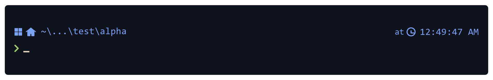

# PowerMini 🚀
> *A minimal, cross-platform Oh My Posh theme*



An ultra-clean, feature-packed minimal theme for **Oh My Posh** designed to deliver maximum terminal utility while keeping screen clutter to an absolute minimum. It features a sleek multi-line workflow, automatic cross-platform capability, and an intelligent balanced directory truncation system.

## ✨ Features

*   **Minimal Footprint:** A beautiful, distraction-free multi-line layout utilizing a single `❯` chevron prompt line and clean transient prompt configuration.
*   **Automatic Native Cross-Platform OS Icons:** Displays native icons automatically based on the host operating system (Windows ⊞, macOS 🍎, and Linux 🐧).
*   **Automatic Native Cross-Platform Slashes:** Path delimiters dynamically adapt to the native OS format (e.g., backslashes on Windows, forward slashes on macOS/Linux).
*   **Balanced Long-Path Separation:** Deep paths dynamically hide intermediate folders using an elegant `...` ellipsis, ensuring a clean display with a balanced folder depth of at most `2` (`max_depth: 2` with `agnoster_short` style).
*   **Right-Aligned Time Tracking:** Clean 12-hour formatted timestamp (`03:04:05 PM`) keeping track of execution states gracefully.

## 🛠️ Prerequisites

1.  **Oh My Posh** installed on your machine.
2.  A **[Nerd Font](https://www.nerdfonts.com/)** applied to your terminal profile (e.g., Meslo, Caskaydia Cove, Fira Code) so all glyphs and icons render flawlessly.
3.  *(Optional for Windows CMD)* **Clink** installed for Windows Command Prompt integration.

## 🚀 Installation

### Using with Clink (Windows CMD)
To link Clink directly to your local `powermini.omp.json` theme file, open your Command Prompt and run:

```cmd
clink set ohmyposh.theme "C:\path\to\your\powermini.omp.json"
```

If you haven't enabled Oh My Posh in Clink yet, configure Clink to use the prompt engine:
```cmd
clink config prompt use oh-my-posh
```

### Using with PowerShell
Add the following line to your PowerShell `$PROFILE` (replacing with the absolute path to your JSON file):

```powershell
oh-my-posh init pwsh --config "C:\path\to\your\powermini.omp.json" | Invoke-Expression
```

### Using with Bash / Zsh (Linux & macOS)
Add the following configuration line to your `~/.bashrc` or `~/.zshrc`:

```bash
eval "$(oh-my-posh init zsh --config /path/to/your/powermini.omp.json)"
```